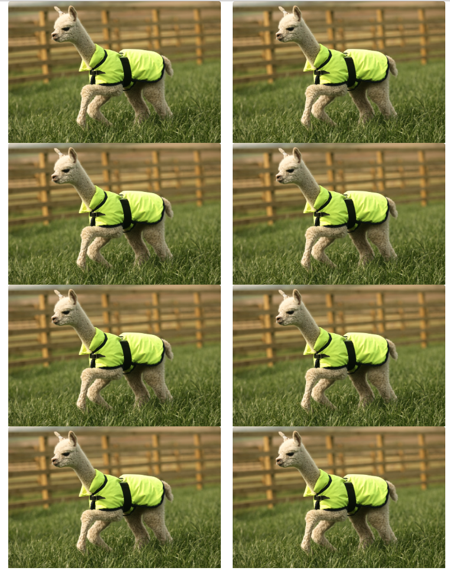

### Student Do: Edge Case Grids (15 minutes)

**Files:**

- [Unsolved/solved.html](Unsolved/unsolved.html)

**Instructions:**

- Open [Unsolved/solved.html](Unsolved/unsolved.html) in your browser.
- Your goal is to create two "rows" of two images each at all browser sizes. (See the image for the end result.)
  - The first part of the solution should use two bootstrap rows.
  - The second part should use one row and a utility class.
  - Both solutions should produce the same result.
- When you are done, refresh [Unsolved/unsolved.html](Unsolved/unsolved.html) to see the changes.

**HINT**

- You will have to use a [Bootstrap utility class](https://getbootstrap.com/docs/4.1/layout/grid/#variable-width-content) for the second part of the solution.

