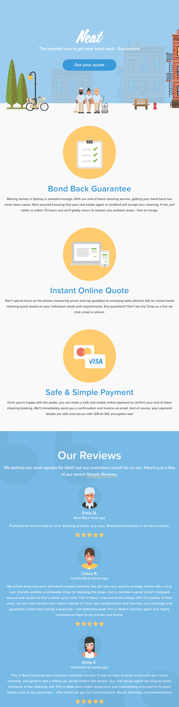
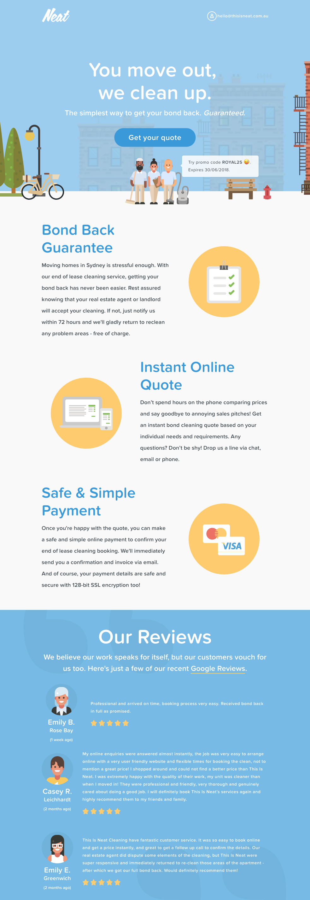

### Student Do: This Is Neat Wireframes (40 minutes)

**Instructions**

- In this activity you are going to create a mobile and desktop wireframe for [This Is Neat](https://thisisneat.com.au/) using the Bootstrap UI kit.

- Site assets and text have been provided to you in the `assets` folder and in `pageText.md`.

- You only have to create your wireframes for a portion of the site, shown in the layout files below. You can also find these images in the `layout` folder.

- **Mobile Version**

- **Desktop Version**

- When you are done, take a screen shot of you wireframes and share in Slack.
